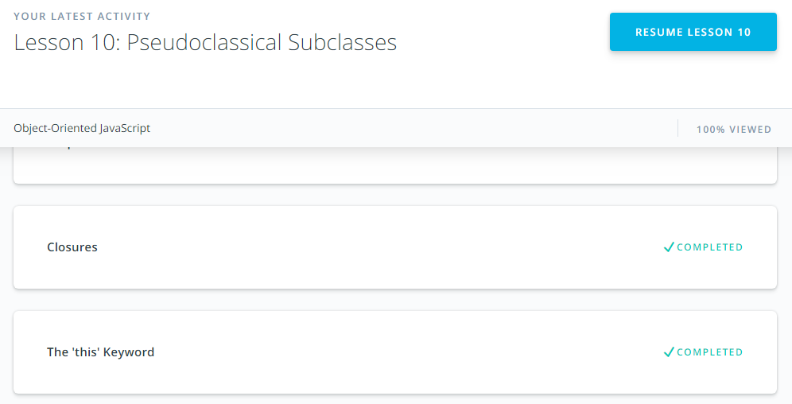
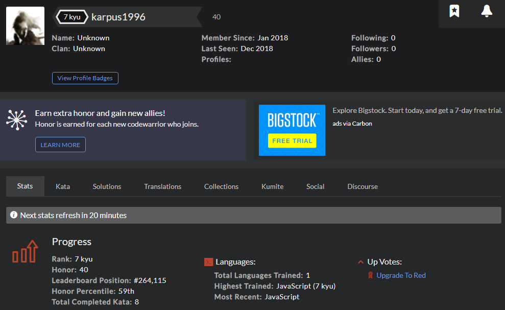

# kottans-frontend

## Practical tasks
#### DOM
[Demo](https://vladk96.github.io/js-dom/) | [Code base](https://github.com/vladk96/js-dom).
Reviewed and approved by [@yevhenorlov](https://github.com/yevhenorlov) and [@IgorKurkov](https://github.com/IgorKurkov)
#### A Tiny JS World
[Demo](https://vladk96.github.io/a-tiny-JS-world/) | [Code base](https://github.com/vladk96/frontend-2019-homeworks/blob/a-tiny-js-world/submissions/vladk96/a-tiny-js-world/index.js).
Reviewed and approved by [@OleksiyRudenko](https://github.com/OleksiyRudenko)
#### Object Oriented JS
[Demo](https://vladk96.github.io/frogger-game/) | [Code base](https://github.com/vladk96/frogger-game/blob/master/js/app.js).
Reviewed and approved by [@OleksiyRudenko](https://github.com/OleksiyRudenko)
#### OOP exercise
[Demo](https://vladk96.github.io/a-tiny-JS-world/) | [Code base](https://github.com/vladk96/frontend-2019-homeworks/blob/a-tiny-oop-task/submissions/vladk96/a-tiny-js-world-oop/index.js).
Reviewed and approved by [@OleksiyRudenko](https://github.com/OleksiyRudenko)
#### Memory pair game
[Demo](https://vladk96.github.io/memory-pair-game/) | [Code base](https://github.com/vladk96/frontend-2019-homeworks/tree/memory-game/submissions/vladk96/memory-pair-game).
Reviewed and approved by [@zonzujiro](https://github.com/zonzujiro)
#### Friends App
[Demo](https://vladk96.github.io/friends-app/) |
[Code base](https://github.com/vladk96/frontend-2019-homeworks/tree/friend-app/submissions/vladk96/friends-app).

## Theoretical tasks
## Git Basics

I have already known basic commands of Git, but I still passed this course again. I also completed the course [Learn Git Branches](https://learngitbranching.js.org/).
In this course I learned a new command 'Cherry-pick' and other tricks with git branches. So, each course was interesting and useful. Thanks a lot.

## Linux CLI, and HTTP

In this task I passed course about command line. This topic was not new for me. I have known the basic commands and I used them before, but I did not know about 'Bash scripting'.
I also read two articles about protocol HTTP.

## Git Collaboration

In this task I passed two courses about Git. I have analyzed the main Git commands. Now I began to undestand Git better.

## Front-End Basics

## Intro to HTML & CSS

I have already known HTML5 and CSS3, but I passed this two courses again to increase my knowledge.

## Responsive Web Design

In this task I passed two courses about responsive web design. I also read arcticle about [Flexbox](https://hackernoon.com/11-things-i-learned-reading-the-flexbox-spec-5f0c799c776b).

## JS Basics

I passed two courses about JavaScript. The second subtask was very interting for me. All exersices was useful.

## DOM

I passed course 'JavaScript and the DOM'. A also did all the algorithm tasks. I really liked this part of the course.

## Advanced Topics

## Object Oriented JS

I this task I passed course about OOP and reached 7 kyu in codewars. Codewars tasks were more difficult than Freecodecamp, but I solved it with pleasure.

