# kottans-frontend

## Git Basics

I have already known basic commands of Git, but I still passed this course again. I also completed the course [Learn Git Branches](https://learngitbranching.js.org/).
In this course I learned a new command 'Cherry-pick' and other tricks with git branches. So, each course was interesting and useful. Thanks a lot.

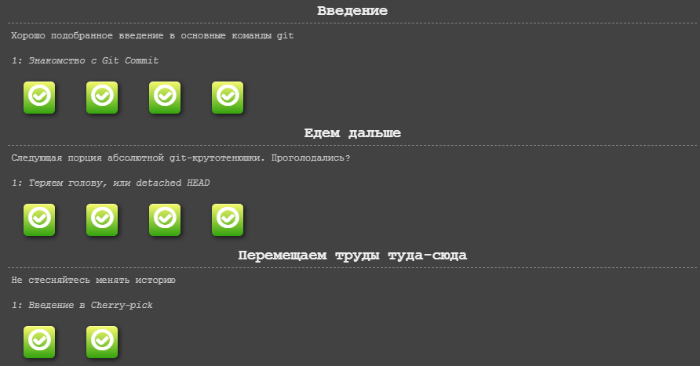
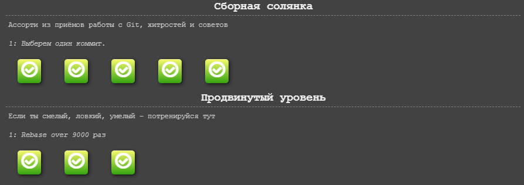
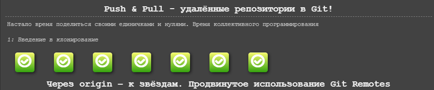

## Linux CLI, and HTTP

In this task I passed course about command line. This topic was not new for me. I have known the basic commands and I used them before, but I did not know about 'Bash scripting'.
I also read two articles about protocol HTTP.

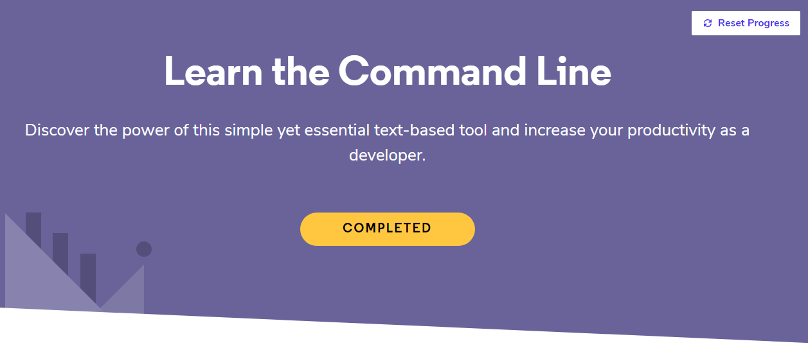

## Git Collaboration

In this task I passed two courses about Git. I have analyzed the main Git commands. Now I began to undestand Git better.

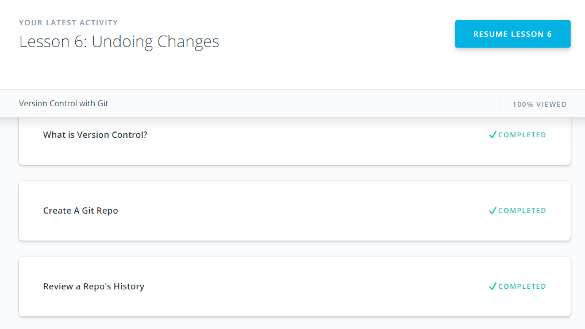
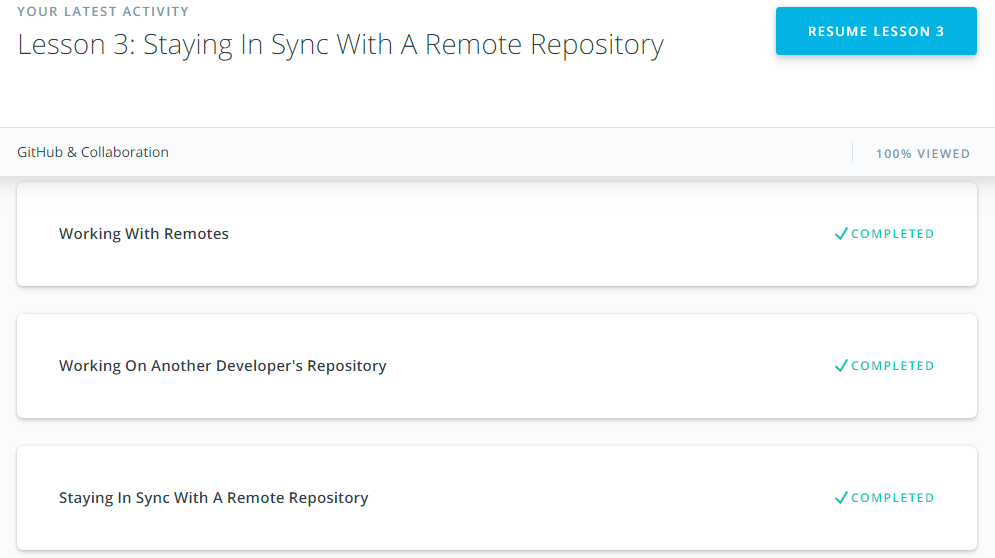

## Front-End Basics

## Intro to HTML & CSS

I have already known HTML5 and CSS3, but I passed this two courses again to increase my knowledge.

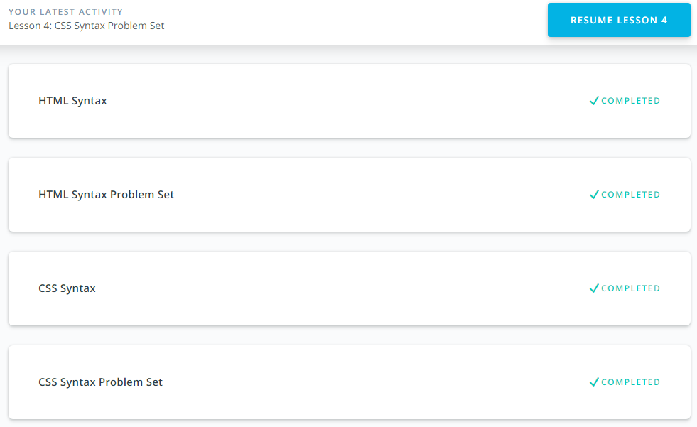
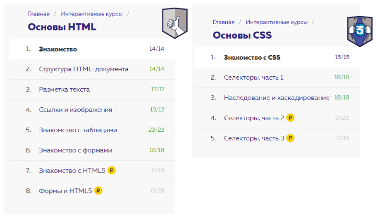

## Responsive Web Design

In this task I passed two courses about responsive web design. I also read arcticle about [Flexbox](https://hackernoon.com/11-things-i-learned-reading-the-flexbox-spec-5f0c799c776b).

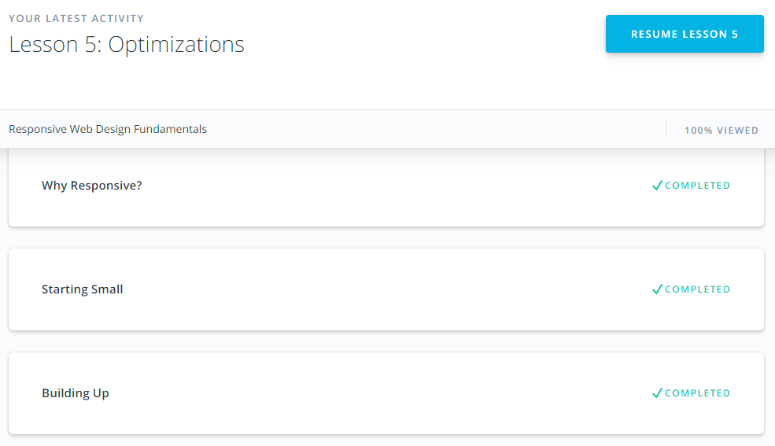
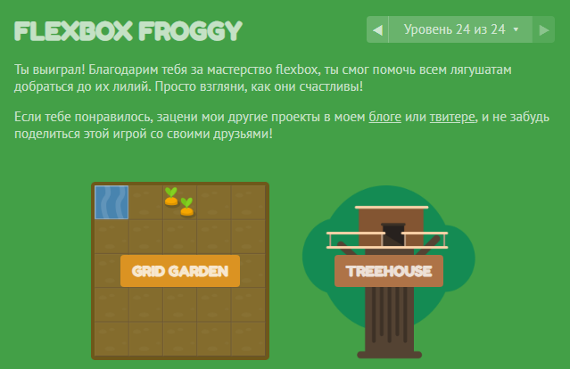

## JS Basics

I passed two courses about JavaScript. The second subtask was very interting for me. All exersices was useful.

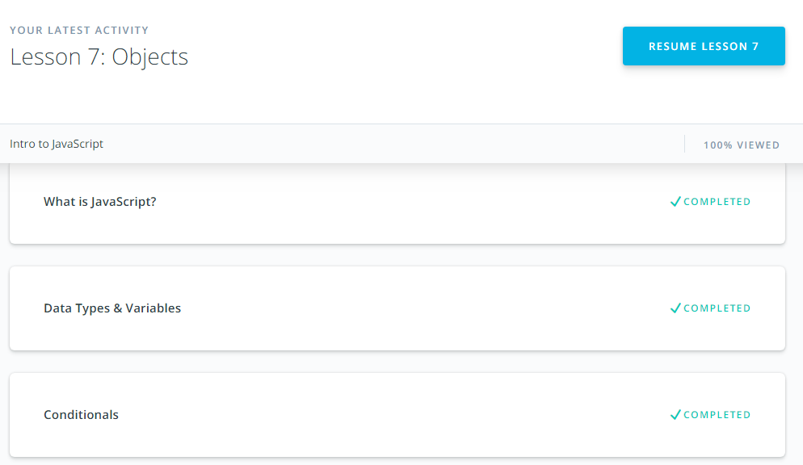
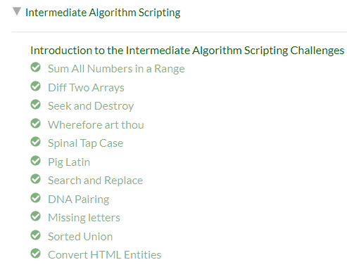

## DOM

I passed course 'JavaScript and the DOM'. A also did all the algorithm tasks. I really liked this part of the course.

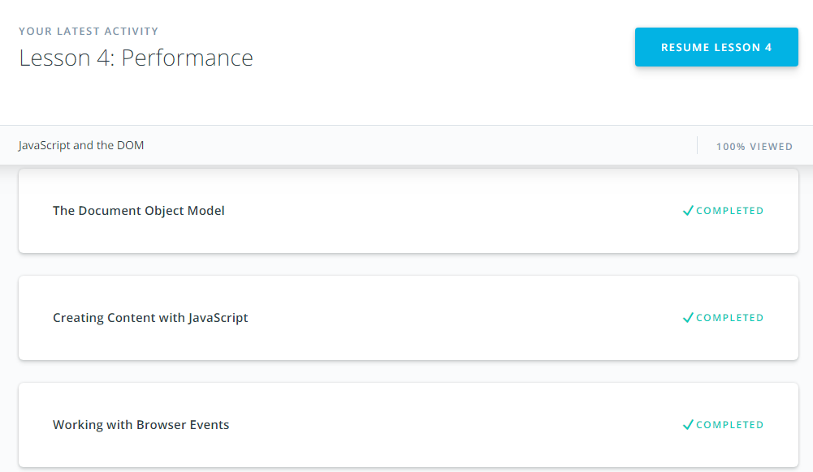
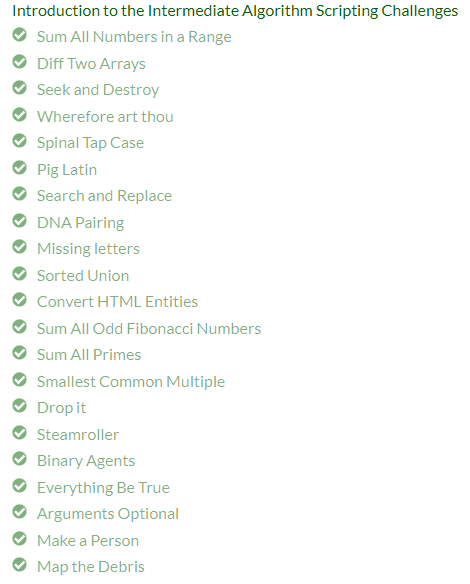